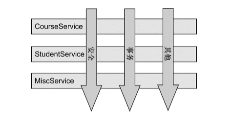
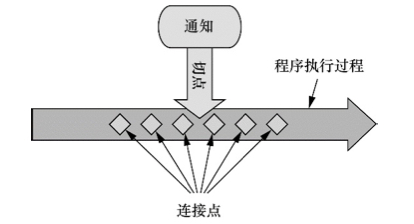
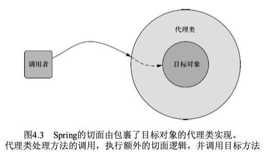
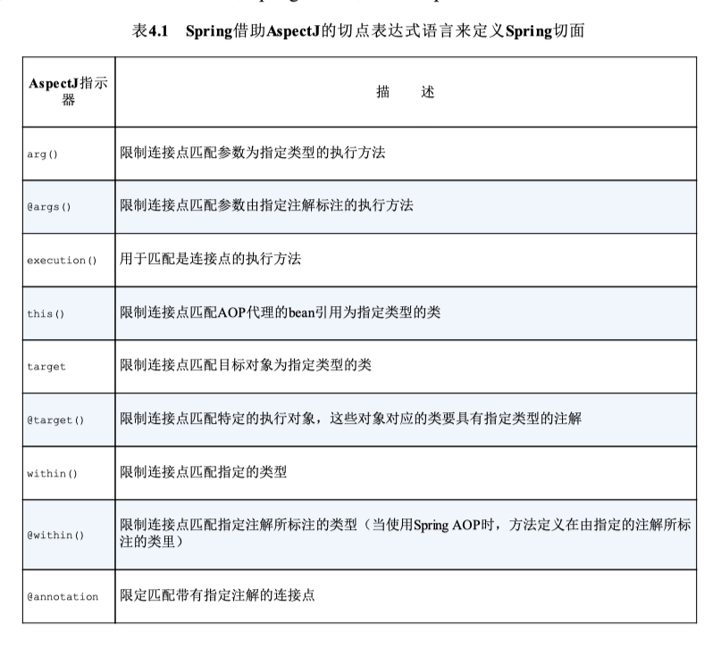
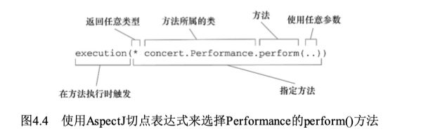
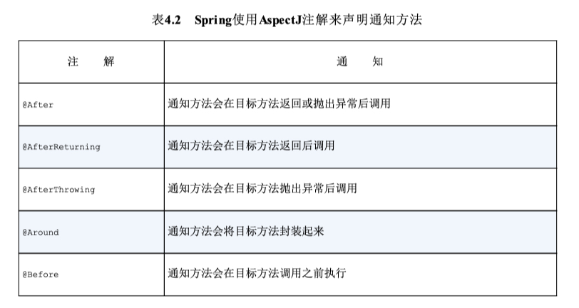

# 面向切面的Spring

## 横切关注点
**横切关注点**可以被描述为影响应用多处的功能，它们散布于应用中,比如 日志，安全，事务管理等。
通常来讲，这些横切关注点从概念上是与应用的业务逻辑相分离的（但是往往会直接嵌入到应用 的业务逻辑之中）。
把这些横切关注点与业务逻辑相分离正是面向切面编程（AOP）所要解决的问题


## AOP术语

### 通知（Advice）
> 在AOP术语中，切面的工作被称为通知, 通知定义了切面是什么以及何时使用

Spring切面可以应用5种类型的通知：

+ 前置通知（Before）：在目标方法被调用之前调用通知功能； 
+ 后置通知（After）：在目标方法完成之后调用通知，此时不会关心方法的输出是什么； 
+ 返回通知（After-returning）：在目标方法成功执行之后调用通知； 
+ 异常通知（After-throwing）：在目标方法抛出异常后调用通知； 
+ 环绕通知（Around）：通知包裹了被通知的方法，在被通知的方法调用之前和调用之后 执行自定义的行为。

### 连接点（Join point）
我们的应用可能有数以千计的时机应用通知。这些时机被称为连接点。

连接点是在 应用执行过程中能够插入切面的一个点。这个点可以是调用方法时、抛出异常时、甚至修改 一个字段时。

切面代码可以利用这些点插入到应用的正常流程之中，并添加新的行为

### 切点（Poincut）
如果说通知定义了切面的“什么”和“何时”的话，那么切点就定义了“何处”。

切点的定义会匹 配通知所要织入的一个或多个连接点。

我们通常使用明确的类和方法名称，或是利用正则表 达式定义所匹配的类和方法名称来指定这些切点。

### 切面（Aspect）
切面是通知和切点的结合。通知和切点共同定义了切面的全部内容——它是什么，在何时和 何处完成其功能(何事)。

### 织入（Weaving）
织入是把切面应用到目标对象并创建新的代理对象的过程

+ 编译期：切面在目标类编译时被织入。这种方式需要特殊的编译器。AspectJ的织入编译 器就是以这种方式织入切面的。 
+ 类加载期：切面在目标类加载到JVM时被织入。这种方式需要特殊的类加载器 （ClassLoader），它可以在目标类被引入应用之前增强该目标类的字节码。AspectJ 5的加载时织入（load-time weaving，LTW）就支持以这种方式织入切面。 
+ 运行期：切面在应用运行的某个时刻被织入。一般情况下，在织入切面时，AOP容器会 为目标对象动态地创建一个代理对象。Spring AOP就是以这种方式织入切面的。


## Spring对AOP的支持

### Spring在运行时通知对象
通过在代理类中包裹切面，Spring在运行期把切面织入到Spring管理的bean中

因为Spring基于动 态代理，所以Spring只支持方法连接点


### 通过切点来选择连接点

注意只有execution指示器是实际执 行匹配的，而其他的指示器都是用来限制匹配的。这说明execution指示器是我们在编写 切点定义时最主要使用的指示器。在此基础上，我们使用其他指示器来限制所匹配的切点

#### 编写切点
切点表达式，这个表达式 能够设置当perform()方法执行时触发通知的调用


### 定义切面
```java
@Aspect
public class Audience_lishi {

  @Pointcut("execution(* Spring.c_01_Spring核心.T04_面向切面的Spring.S01_使用注解来创建切面.Performance.perform(..))")
  public void perform() {}

  @Around("perform()")
  public void watchPerformance(ProceedingJoinPoint joinPoint) throws Throwable {
    System.out.println("表演开始前，李四: 关闭手机");
    joinPoint.proceed();
    System.out.println("表演成功后，李四: 起立，👏 👏 👏");
  }
}
```
#### @Aspect
@AspectJ注解进行了标注。该注解表明该类不仅仅是一个POJO， 还是一个切面。类中的方法都使用注解来定义切面的具体行为
#### 通知


#### @Pointcut
@Pointcut注解能够在一个@AspectJ切面内定义可重用的 切点。

```java
  @Pointcut("execution(* Spring.c_01_Spring核心.T04_面向切面的Spring.S01_使用注解来创建切面.Performance.perform(..))")
  public void perform() {}
```
perform()方法的实际内容并不重要，在这里它实际上应该是空的。其实该方法本身 只是一个标识，供@Pointcut注解依附
